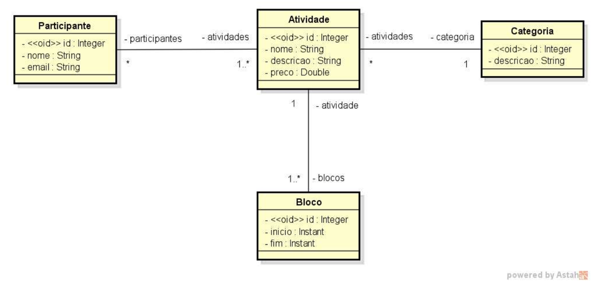
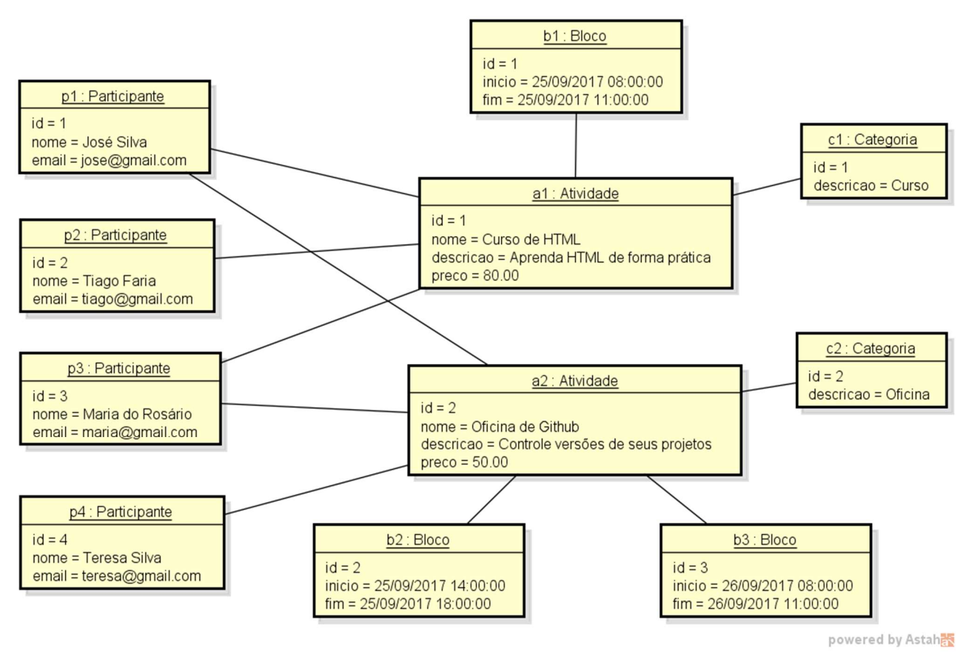

<div align='center' id='top'>
  
# Domain Model & ORM - Academic Event System
 
  
  
  
  
  
 
</div>

A Spring Boot application built to practice **domain modeling and Object-Relational Mapping (ORM)** concepts using JPA and Hibernate. The project models an academic event system, where participants can enroll in activities (courses, lectures, workshops), each divided into time slots and classified by category. 
<br><br>
The goal of this project is to build a system to manage information about participants of an academic event's activities. Activities can be, for example, lectures, courses, or hands-on workshops. Each activity has a name, description, and price, and can be divided into several time slots (for example, an HTML course can happen across two time slots, so it's necessary to store the day and the start/end times of each slot). For each participant, the system stores their name and email.
 
 
---
 
## Table of Contents
- [Technologies](#technologies)
- [Architecture](#architecture)
- [Project Structure](#projectStructure)
- [Diagrams](#diagrams)
- [Entity Relationships](#entityRelationships)
- [Seeding Data](#seedingData)
- [Running Locally](#runningLocally)
- [License](#license)

---
 
<div id='technologies'/>
  
## Technologies
 
| Badge | Technology | Purpose |
|---|---|---|
|  | Java 25 | Programming language |
|  | Spring Boot | Application framework |
|  | Hibernate / JPA | Object-Relational Mapping (ORM) |
|  | H2 Database | In-memory relational database |
|  | Maven | Build and dependency management |

---
 
<div id='architecture'/>
  
## Architecture
 
This project follows a simple **domain-centric** structure, where all entities and their JPA/Hibernate mappings live in a single `domain` package, kept decoupled from the application's configuration and seed data.
 
- **domain**: contains the JPA entities (`Participant`, `Activity`, `Category`, `TimeSlot`) along with their relationships, mapped through annotations such as `@ManyToOne` and `@ManyToMany`.
- **resources**: contains the application configuration (`application.properties`, `application-test.properties`), the custom startup banner (`banner.txt`), and the seed data script (`import.sql`) used to populate the H2 database on startup.

---
 
<div id='projectStructure'/>
  
## Project Structure
 
```
domain-model-orm/
├── src/
│   ├── main/
│   │   ├── java/
│   │   │   └── com/willaevangelista/domainmodelorm/
│   │   │       ├── domain/
│   │   │       │   ├── Activity.java
│   │   │       │   ├── Category.java
│   │   │       │   ├── Participant.java
│   │   │       │   └── TimeSlot.java
│   │   │       └── DomainModelOrmApplication.java
│   │   └── resources/
│   │       ├── application.properties
│   │       ├── application-test.properties
│   │       ├── banner.txt
│   │       └── import.sql
├── docs/
│   ├── domain-model-diagram.png
│   └── seeding-data-diagram.png
├── .gitignore
├── LICENSE
└── README.md
``` 
 
---
 
<div id='diagrams'/>
  
## Diagrams
 
### Domain Model - UML Class Diagram
 
<p align="center">
  
</p>

### Seeding Data - Instance Diagram

<p align="center">
  
</p>

---
 
<div id='entityRelationships'/>
  
## Entity Relationships
 
| Relationship | Type | Description |
|---|---|---|
| `Activity` ↔ `Participant` | Many-to-Many | An activity can have several participants, and a participant can be enrolled in several activities |
| `Activity` → `Category` | Many-to-One | Every activity belongs to a single category |
| `TimeSlot` → `Activity` | Many-to-One | Every time slot belongs to a single activity |
 
---
 
<div id='seedingData'/>
  
## Seeding Data
 
On startup, the application populates the H2 in-memory database with sample data via `import.sql`, including:
 
- 4 participants
- 2 activities
- 2 categories
- 3 time slots
This allows the domain model and its relationships to be explored immediately through the H2 console, without any manual data entry.
 
---
 
<div id='runningLocally'/>
  
## Running Locally
 
```bash
./mvnw spring-boot:run
```
 
Once the application starts, the H2 console will be available at:
 
```
http://localhost:8080/h2-console
```
 
Use the JDBC URL configured in `application.properties` to connect and explore the seeded data.
 
---
 
<div id='license'/>
  
## License
 
This project is licensed under the MIT License - see the `LICENSE` file for details.
 
<div align='right'>
  
  [Back to top of page ⬆️](#top)
 
</div>
